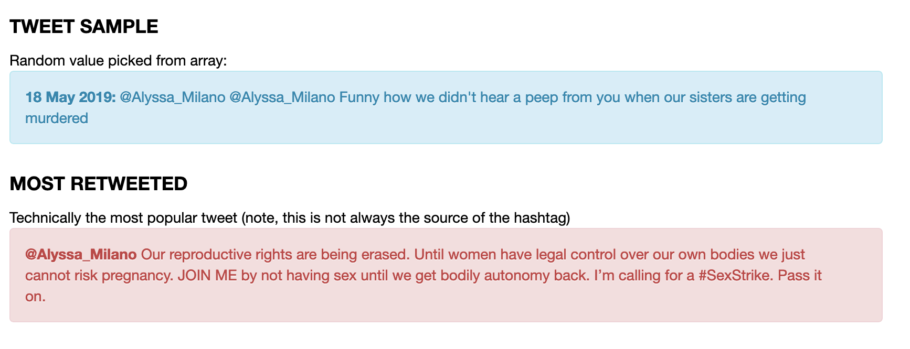
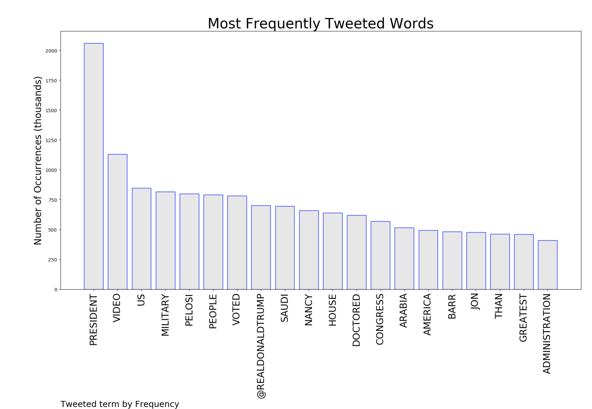
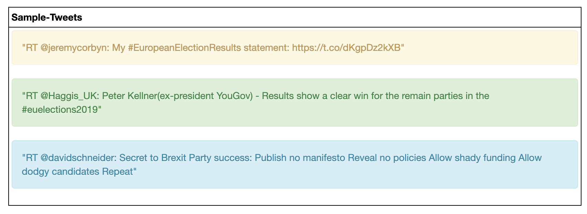
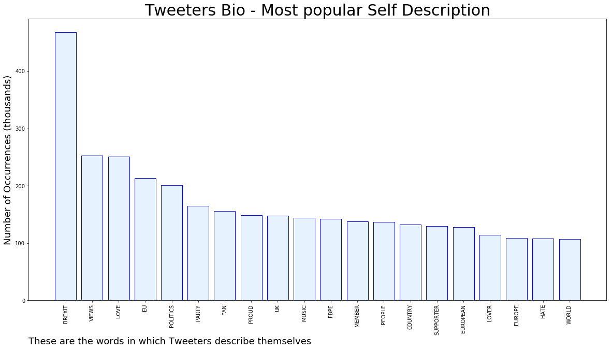
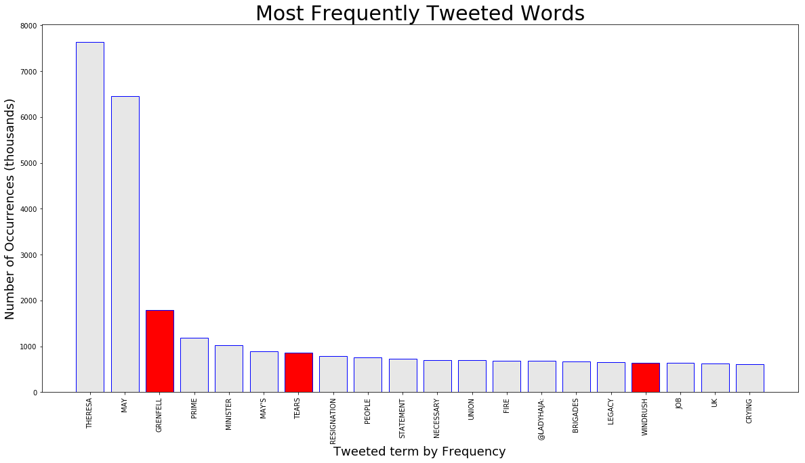

# DEPOLARIZE & RENORMALIZE 

&#x1F34E; **AUTHOR = @McMurchie**

# SOCIAL INTELLIGENCE = SOCIAL BENEVOLENCE

 

**THANKS** for landing here! This page links to social media objectivity reports *(i.e. what people tweet, their bio's background)* I have generated on trending topics, they now include google trends *(what people are searching)* . The aim of this project is to help depolarize social media and western society in gneral by shining light on what people are **ACTUALLY** saying, and not what our own self contained echo-chamber tells us 

I do take requests *in fact I would love some* , below are a list of the reports so far, click on them to see the results: 

[SexStrike metrics](https://github.com/murchie85/TwitterStreamFilter/blob/master/SEXSTRIKE.ipynb) |  💛 💙 💜 ❤️ 💚

#SEXSTRIKE Analytics           |  Click Link above for full report
:-------------------------:|:-------------------------:
<a href="https://github.com/murchie85/TwitterStreamFilter/blob/master/SEXSTRIKE.ipynb"> |  </a>

[TRUMP metrics]("https://github.com/murchie85/TRUMP-TWITTER-ANALYTICS/blob/master/TRUMP%20HISTORICAL%20ANALYSIS.ipynb") |  🇺🇸🇺🇸🇺🇸

#TRUMP Analytics           |  Click Link above for full report
:-------------------------:|:-------------------------:
<a href="https://github.com/murchie85/TRUMP-TWITTER-ANALYTICS/blob/master/TRUMP%20HISTORICAL%20ANALYSIS.ipynb"> |  </a>

[EU REF metrics]("https://github.com/murchie85/EU-Election-Twitter-Analysis-2019/blob/master/EU-ANALYSIS.ipynb") | 🇪🇺🇪🇺🇪🇺

#EU Election Analytics           |  Click Link above for full report
:-------------------------:|:-------------------------:
<a href="https://github.com/murchie85/EU-Election-Twitter-Analysis-2019/blob/master/EU-ANALYSIS.ipynb"> |  </a>

[Brexit Metrics](https://github.com/murchie85/BREXIT-TWITTER/blob/master/BREXIT.ipynb ) | 🇬🇧 🇬🇧 🇬🇧 

#Brexit Analytics           |  Click Link above for full report
:-------------------------:|:-------------------------:
<a href="https://github.com/murchie85/BREXIT-TWITTER/blob/master/BREXIT.ipynb"> |  </a>

[Theressa May - Twitter Metrics](https://github.com/murchie85/MAY-TWITTER-ANALYSIS/blob/master/May.ipynb) | 🙈🙈

#May Analytics           |  Click Link above for full report
:-------------------------:|:-------------------------:
<a href="https://github.com/murchie85/MAY-TWITTER-ANALYSIS/blob/master/May.ipynb"> |  </a>

[Abortion & Alabama Metrics](https://github.com/murchie85/-ALABAMA-Metrics/blob/master/ALABAMA.ipynb) |  ⚠️⚠️⚠️

Abortion/Alabama Analytics           |  Click Link above for full report
:-------------------------:|:-------------------------:
<a href="https://github.com/murchie85/-ALABAMA-Metrics/blob/master/ALABAMA.ipynb"> |  </a>

